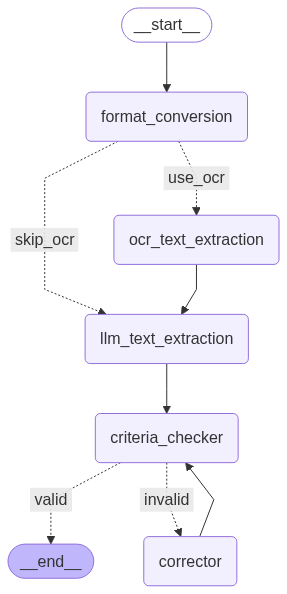

# Structured-OCR

A robust solution for extracting structured data from scanned documents using a combination of Google Document AI and LLM-OCR techniques. This tool converts unstructured document images into structured, customizable outputs perfect for RAG (Retrieval Augmented Generation) applications and data processing pipelines.

## Features

- **Customizable Schema Output**: Define your own Pydantic schemas for structured data extraction tailored to your specific document types and use cases.
- **Text Extraction**: High-quality extraction of text with various styles, including text within images.
- **Form/Table Extraction**: Conversion of tabular data into structured CSV format.
- **Image Description**: AI-powered description of images and infographics within documents.
- **Preprocessing Pipeline**: Built-in image preprocessing including deskewing and white balance adjustment.
- **Quality Verification**: Automated verification and correction of extracted content using configurable criteria and LLM validation.
- **Structured Output**: Results delivered as Pydantic objects for easy integration into downstream applications.
- **Flexible Document Types**: Adaptable to various document formats - invoices, forms, reports, articles, legal documents, and more.

## LLM-OCR vs OCR

| Aspect         | LLM-OCR                                                                                                                                                                                                                                                                                       | OCR                                                                                                                                                                                                                                               |
| -------------- | ------------------------------------------------------------------------------------------------------------------------------------------------------------------------------------------------------------------------------------------------------------------------------------------------ | ------------------------------------------------------------------------------------------------------------------------------------------------------------------------------------------------------------------------------------------------- |
| **Strengths**  | • Good at parsing forms<br>• Simultaneously understands the context and fixes mixing up<br>• Able to describe images<br>• Self-correction capabilities<br>• Potential to swap to next-gen models for better results<br>• Potential to extract images (positions) (failed)<br>• Acts as the brain | • Kind of deterministic<br>• Lower latency<br>• Could parse forms by specialized processor, but format could be wrong<br>• PaddleOCR can parse forms and images, but the overall quality / accuracy is nowhere near Google<br>• Acts as the brawn |
| **Weaknesses** | • Varies as the prompt<br>• Prone to hallucination                                                                                                                                                                                                                                               | • Format could be wrong<br>• Impossible to self-correct, structured outputs to different items, unlike LLMs<br>• No image extraction found in Google Document AI for now                                                                          |

This hybrid approach leverages the strengths of both technologies to produce superior results.

Both Google Document AI and LLM services used in this project are very cost-effective:

- Document AI: ~$1.5 per 1,000 pages
- Gemini 2.0 Flash: ~\$0.1 per 1M tokens input and \$0.4 per 1M tokens output

## Architecture

The system combines traditional OCR with LLM capabilities to achieve superior structured outputs:



### Components

1. **Preprocessing** ([structured_ocr/preprocess/](structured_ocr/preprocess/)):

   - Deskewing, white balance adjustment, clarity enhancement
   - Optional contrast/brightness/denoising capabilities

2. **OCR** ([structured_ocr/ocr/](structured_ocr/ocr/)):

   - Google Document AI integration
   - Text extraction with detailed metadata

3. **LLM-OCR** ([structured_ocr/llm_ocr/](structured_ocr/llm_ocr/)):

   - Customizable prompts and schemas for any document type
   - Text extraction with layout understanding
   - Table extraction and formatting
   - Image description generation
   - Quality verification and correction using configurable criteria

4. **Utilities** ([structured_ocr/utils.py](structured_ocr/utils.py)):
   - Helper functions for file handling
   - Visualization utilities
   - Document processing tools

## Schema and Criteria System

### Defining Your Schema

Create Pydantic models to define the structure of your extracted data in [schema.py](schema.py):

```python
from pydantic import BaseModel, Field
from typing import Literal

class Player(BaseModel):
    name: str = Field(description="The name of the player")
    level: int = Field(description="The level of the player where MAX is 1000")
    kills: int = Field(description="The number of kills the player has")
    score: int = Field(description="The score of the player")

class Match(BaseModel):
    side: Literal["Heroes", "Villains"] = Field(description="The side of the match as shown on top")
    me: Player = Field(description="The player who is in yellow highlight")
    teammates: list[Player] = Field(description="Players on the same side as 'me'")
    enemies: list[Player] = Field(description="Players on the opposite side")

# Set as target schema
TARGET_SCHEMA = Match
```

### Custom Prompt Definition
Change the prompt in [prompt.py](prompt.py).

### Custom Criteria Definition

Define validation criteria that map to your schema fields, for example:

```python
class Criteria(BaseModel):
    """Custom validation criteria for your document type."""
    
    team_identification: int = Field(
        description="Verify team names are correctly identified", 
        ge=0, le=10
    )
    player_data_accuracy: int = Field(
        description="Check player stats are accurately extracted", 
        ge=0, le=10
    )
    grouping_logic: int = Field(
        description="Ensure teammates/enemies are correctly grouped", 
        ge=0, le=10
    )
    
    reasons: str = Field(
        description="Detailed reasons for any criteria not met"
    )

# Map criteria to schema fields for targeted validation
CRITERIA_TO_RELATED_FIELDS = {
    "team_identification": ["side"],
    "player_data_accuracy": ["me", "teammates", "enemies"], 
    "grouping_logic": ["me", "teammates", "enemies"],
}
```

### Context Management for LLM

The system uses multiple levels of context to guide the LLM:

**1. Schema-Level Context**: Field descriptions provide extraction guidance
```python
side: Literal["Team 1", "Team 2"] = Field(
    description="The side of the match as shown on top"  # Tells LLM where to look
)
```

**2. Prompt-Level Context**: Higher-level instructions about document structure
- Document type and layout expectations
- Specific terminology and formats
- Extraction priorities and edge cases

**3. Criteria-Level Context**: Validation-specific guidance
- What constitutes accurate extraction
- Acceptable ranges and formats
- Relationship validation between fields

### Iterative Validation Process

1. **Schema-Guided Extraction**: LLM extracts using field descriptions
2. **Criteria Evaluation**: Each criterion scores 0-10 based on accuracy
3. **Targeted Correction**: Only fields linked to failed criteria are re-extracted
4. **Context Refinement**: Prompts are adjusted based on specific failures

## Installation

```bash
# Clone the repository
git clone https://github.com/teron131/structured-ocr
cd Structured-OCR

# Install dependencies
uv sync

# Setup your environment variables
cp .env.example .env
# Edit .env with your API keys and configuration

# Setup Google Cloud credentials
```

### Requirements

- Google Cloud credentials and setup(for Document AI)
- API key for Gemini or other LLM service
- Dependencies: Pillow, OpenCV, SciPy, Google Document AI, LangChain, LangGraph, Pydantic, ...

## Usage

### Basic Usage with Default Schema

```python
from structured_ocr.llm_ocr.graph import run_graph

image_path = "path_to_document_image"
result = run_graph(image_path)
```

### Customize Schema and Prompt
Change the schema in [schema.py](schema.py) and prompt in [prompt.py](prompt.py).

```python
from structured_ocr.llm_ocr.graph import run_graph
from schema import TARGET_SCHEMA

# Use custom schema
result = run_graph(
    image_path="game_scoreboard.jpg",
    schema=TARGET_SCHEMA
)
```

### Batch Processing

```python
from structured_ocr.llm_ocr.graph import batch_run_graph

image_paths = ["doc1.jpg", "doc2.jpg", "doc3.jpg"]
results = batch_run_graph(image_paths, schema=TARGET_SCHEMA)
```

## Example Output

```bash
🚀 Start processing: data/images/scoreboard.jpg
🖼️ Image Preprocessing complete: data/images/scoreboard.jpg
🔄 Format Conversion complete: data/images/scoreboard.jpg
🔡 OCR complete: data/images/scoreboard.jpg
🧠 LLM Text Extraction complete: data/images/scoreboard.jpg
🧠 LLM Image Description complete: data/images/scoreboard.jpg
🔗 Results concatenation complete: data/images/scoreboard.jpg
🔍 Criteria Checker 0 complete: data/images/scoreboard.jpg
📝 Corrector 1 complete: data/images/scoreboard.jpg
🔍 Criteria Checker 1 complete: data/images/scoreboard.jpg
🎉 Process complete: data/images/scoreboard.jpg

Match(
    side='Team 1',
    me=Player(
        name='Player1',
        level=850,
        kills=12,
        score=2450
    ),
    teammates=[
        Player(name='Teammate1', level=720, kills=8, score=1890),
        Player(name='Teammate2', level=650, kills=6, score=1560)
    ],
    enemies=[
        Player(name='Enemy1', level=800, kills=10, score=2100),
        Player(name='Enemy2', level=750, kills=9, score=1980)
    ]
)
```

